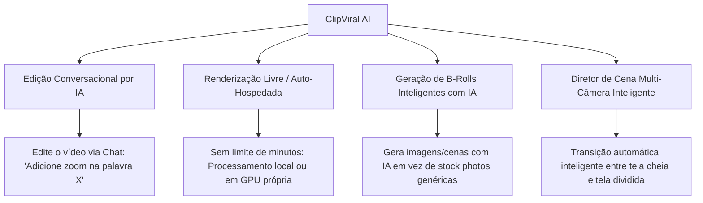

# Especificação do Produto: ClipViral AI SaaS

Este documento detalha a arquitetura de telas, menus, fluxos de usuário e recursos competitivos do **ClipViral AI**, comparando-o com o **Opus Clip** e descrevendo os diferenciais estratégicos que tornarão nossa plataforma superior.

---

## 1. O que o Opus Clip oferece?
O Opus Clip é a ferramenta líder de mercado para converter vídeos longos em cortes curtos. Seus principais recursos incluem:
* **Curadoria por IA (Viral Score):** Analisa a transcrição e o contexto para encontrar os momentos mais propensos a viralizar.
* **Auto Reframe (Detecção de Orador):** Recorta vídeos horizontais em 9:16 seguindo o rosto de quem está falando.
* **Legendas Dinâmicas:** Legendas coloridas automáticas com palavras destacadas e suporte a emojis automáticos.
* **Layouts de Tela Dividida:** Suporte para podcasts com dois oradores ou gravação de tela + câmera (estilo gameplay).
* **Agendador de Redes Sociais:** Publicação direta no TikTok, YouTube Shorts e Instagram Reels.
* **Pacotes de Marca (Brand Kits):** Salvamento de fontes, paletas de cores e logotipos para manter a identidade visual.

---

## 2. Como o ClipViral AI será MELHOR? (Nossos Diferenciais)

Para superar o Opus Clip, nossa plataforma oferece vantagens técnicas e de experiência de usuário únicas:



1. **Edição Conversacional por IA (Copilot Chat):** Em vez de apenas aceitar o corte gerado, o usuário pode interagir com um chat de IA para fazer edições refinadas: *"Dê um zoom na parte que falo sobre dinheiro"*, *"Mude a cor da legenda para amarelo no final"*.
2. **Motor de Renderização Híbrido (Free tier ILIMITADO):** Diferente do Opus Clip (que cobra estritamente por minuto processado na nuvem), oferecemos um modelo de processamento local/híbrido (utilizando FFmpeg e modelos locais leves) permitindo aos usuários processar vídeos sem limites de tempo se rodarem em seu próprio hardware ou pagando custos de GPU reais extremamente baixos.
3. **B-Rolls Gerados por IA Contextual:** Em vez de usar imagens e vídeos de estoque genéricos e repetitivos, integramos geração de imagens em tempo real para ilustrar conceitos complexos discutidos no vídeo.
4. **Diretor de Cena Multi-Câmera Inteligente (AI Co-Director):** Otimizado para detectar cortes rápidos e transições de tela dividida customizadas, permitindo controle total do layout frame-a-frame através de presets arrastáveis.

---

## 3. Arquitetura de Telas e Menus (SaaS Dashboard)

O design segue um tema escuro (Dark Mode Premium) com acabamentos em vidro (glassmorphic) e tons violeta/fúcsia neon.

```
+--------------------------------------------------------------------------------+
|  LOGO [ClipViral AI]       Painel  •  Histórico  •  Integrações     [Credits: 10] |
+--------------------------------------------------------------------------------+
|  [ COLUNA ESQUERDA: ENTRADA E CONFIG ]   |  [ COLUNA DIREITA: FEED DE VÍDEOS ]   |
|                                          |                                       |
|  +------------------------------------+  |  +---------------------------------+  |
|  | FAZER UPLOAD DE VÍDEO              |  |  MEUS VÍDEOS PROCESSADOS           |  |
|  | [ Arraste seu MP4/Link do YT ]     |  |  - Podcast Empreendedor (Sucesso)  |  |
|  +------------------------------------+  |  |  +---------------------------+  |  |
|                                          |  |  | Cortar 1 (Score 95) [Ver]  |  |  |
|  +------------------------------------+  |  |  | Cortar 2 (Score 88) [Ver]  |  |  |
|  | PERSONALIZAR LEGENDAS              |  |  |  +---------------------------+  |  |
|  | Tamanho: [ 28px  ]                 |  |  - Aula de Marketing (Processando) |  |
|  | Cor:    [ #FF00FF ] [ ]            |  |  +---------------------------------+  |
|  | Estilo: [ Borda ] [ Fundo ]        |  |                                       |
|  | [ Salvar Preferências ]            |  |                                       |
|  +------------------------------------+  |  |                                       |
+--------------------------------------------------------------------------------+
```

### Menu de Navegação Superior (Navbar)
* **Logo:** Ícone dinâmico em gradiente com o nome `ClipViral AI`.
* **Painel (Dashboard):** Tela principal de criação e edição.
* **Histórico/Arquivos:** Acesso a todos os vídeos enviados e cortes gerados anteriormente.
* **Configurações/Cobrança:** Painel de assinatura, limites e compra de créditos extras.
* **Perfil do Usuário:** Foto, e-mail, créditos atuais e botão de logout.

### Tela 1: Dashboard Principal (Upload e Configurações)
* **Seção de Upload:**
  * Suporte a arquivos locais (arrastar e soltar) de até 1 hora.
  * Input de link (URL direta do YouTube, Google Drive ou Dropbox).
  * Seleção de idioma do áudio (Português, Inglês, Espanhol).
* **Seção de Estilos de Legenda (Brand Kit):**
  * Paleta de cores da marca (cor primária e cor de destaque do karaoke).
  * Tamanho da fonte e seleção de tipografia (Montserrat, Inter, Arial).
  * Estilo das legendas:
    * *Estilo Borda (Outline):* Letras com contorno preto e sombra suave.
    * *Estilo Caixa (Boxed):* Fundo preto translúcido ao redor do texto para máxima leitura.

### Tela 2: Visualizador e Editor de Cortes (Foco de Conversão)
Uma tela focada em exibição lado-a-lado quando o usuário clica em **"Ver Corte"**:
* **Player do Vídeo (Vertical 9:16):** Exibe o vídeo editado final com as legendas e transições.
* **Transcrição Interativa:** Mostra o texto completo do corte. O usuário pode clicar em palavras individuais para corrigir a transcrição ou ajustar o tempo do karaoke.
* **Chat do Copilot:** Painel lateral onde o usuário pode solicitar modificações ao editor inteligente via texto.
* **Botão Exportar/Compartilhar:**
  * Download direto em Full HD (1080p).
  * Enviar diretamente para as contas integradas do YouTube Shorts, TikTok ou Instagram.

---

## 4. Próximas Fases de Desenvolvimento do SaaS

Para concretizar esse produto em fases modulares e robustas, propomos o seguinte cronograma:

* **Fase 4: Integração de APIs de Redes Sociais e Agendamento**
  * Conexão via OAuth2 com as APIs oficiais do TikTok, YouTube e Facebook/Instagram.
  * Criação da fila de agendamento em background (Celery ou Redis Queue).
* **Fase 5: Motor AI Co-Director (Split-Screen & Face Tracking)**
  * Integração de modelo de detecção facial ultrarápido no Python backend.
  * Criação dinâmica de crop layouts 9:16 centralizados no falante ativo.
* **Fase 6: Chat de Edição Conversacional**
  * Integração de LLM local/cloud capaz de traduzir comandos de chat do usuário em instruções de filtros para a nossa API do FFmpeg.
